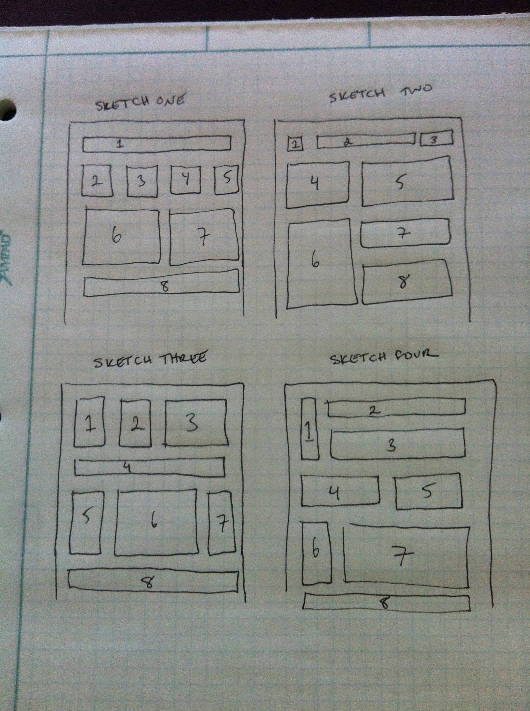

Learn Floats
============

**Understand floating elements**

#What's the deal here?
The goal of this exercise is to understand how to make different layouts using a single html file, and only changing how the elements float.  This is the basics of floating and is the best way I've found to understand what's going on.

The exercise uses 8 divs in a container, with no margins or padding. It will look ugly, but will give you the framework for understanding floats.

##The Challenge
The challenge for you is to produce the layouts I've sketched out changing only the`height`, `width`, `float`, and `clear` values for each element.

###The Sketches:

##Try it out
Clone this repo, open the files and look at styles.css to get started. The comments in there will guide you.
